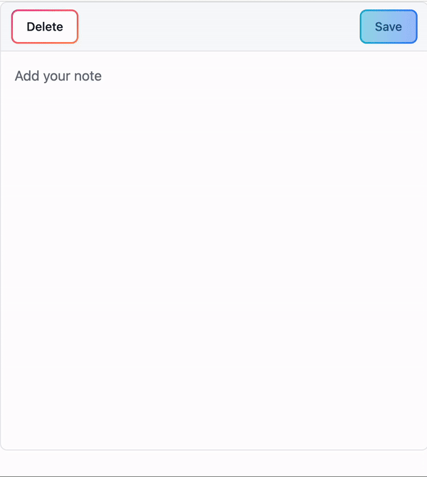

# Scratchpad

A notes app focused on adding new ideas. The service worker installs the app for full offline use. Intended for use as a mobile PWA.

[🔗 Demo](https://andreidobrinski.com/scratchpad/)

## Running locally

1. Clone this repo
2. Install dependencies: `npm i`
3. Run the app: `npm run dev`

## Technologies used

- [SvelteKit](https://kit.svelte.dev)
- [Flowbite](https://flowbite-svelte.com)
- [Tailwind](https://tailwindcss.com)
- [XState](https://xstate.js.org)
- [Vite PWA](https://vite-pwa-org.netlify.app)
- [UUID](https://github.com/uuidjs/uuid)

